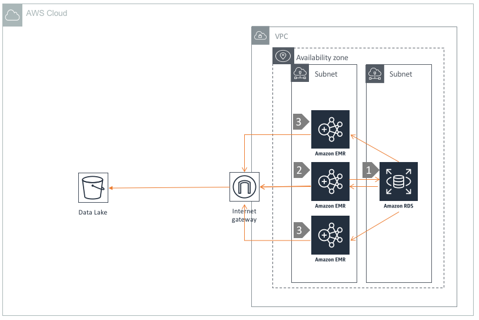

# Query Data lake using EMR and External Hive Metastore in VPC

## Overview

Amazon EMR is a managed Hadoop framework in AWS. EMR is widely used by AWS customers to process vast amount of data in the cloud. EMR securely and reliably handles a broad set of big data use cases, including log analysis, web indexing, data transformations (ETL), machine learning, financial analysis, scientific simulation, and bioinformatics.

Hive is a data infrastructure tool to process structured/semistructured data in Hadoop using SQL like query language. Hive stores and manages schema metadata using Hive metastore service backed by a relational database. In a data lake environment, it is essential to have a centralized schema repository for other engines to access.Most of our customers leverage glue as an external catalog due to ease of use. However, customers may want to set up their own centralized catalog due to legacy reasons outlined [here](../../README.md).

## Architecture  Walkthrough

In this architecture, we will provide a walkthrough of how to set up a centralized schema repository using EMR with RDS and  multiple EMR clusters can execute queries against the same schema metadata. To avoid, accidental schema  metadata loss/corruption, it is recommended that you provide database write access to one EMR cluster only.

1. RDS database is used  to store metadata information in a VPC.

2. Single EMR Cluster is set up with Hive metastore on RDS database in same VPC but different subnet. This EMR cluster would have write access on the RDS. The permissions can be managed using RDS user.

3. Multiple EMR clusters can be deployed with read access schema metadata on Hive metastore. Read-only EMR clusters can execute queries against the S3 using Internet Gateway on the VPC.
