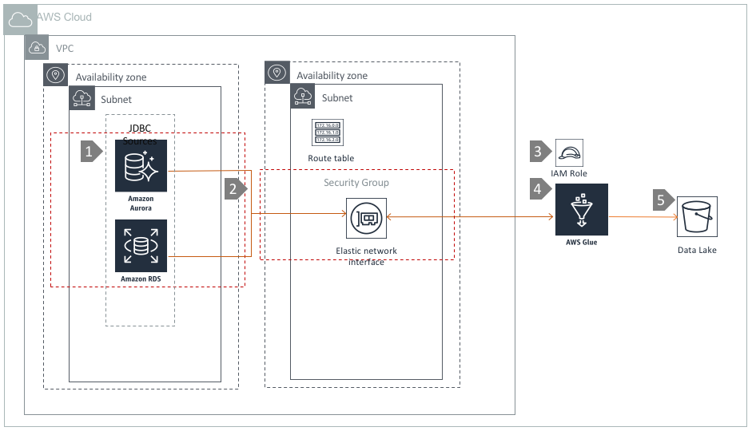

# Data Ingestion using Amazon Glue

## Overview

WS Glue is a fully managed extract, transform, and load (ETL) service that makes it easy for customers to prepare and load their data for analytics. It can extract data from heterogeneous data sources like RDBMS (RDS, Aurora), Amazon Redshift, Amazon S3 etc. AWS Glue uses spark processing engine under the hood and supports spark APIs to transform data in memory, In this architecture, we are using Glue to extract data from relational datasources in a VPC and ingest them in to a S3 data lake backed by S3.

## Architecture Component Walkthrough

1. Relational databases on RDS and/or Aurora within a VPC.

2. Amazon Glue that can connect to the databases using JDBC through an Elastic Network Interface(ENI) in the same VPC.

3.  S3 data lake to store data captured by Amazon Glue. It is recommended to write structured data to S3 using compressed columnar format like Parquet/ORC for better query performance. Data in tabular format can be converted into compressed columnar format with Pyspark/Scala using spark APIs in ETL Glue.

4. IAM role for Amazon Glue jobs that has   write access to S3
